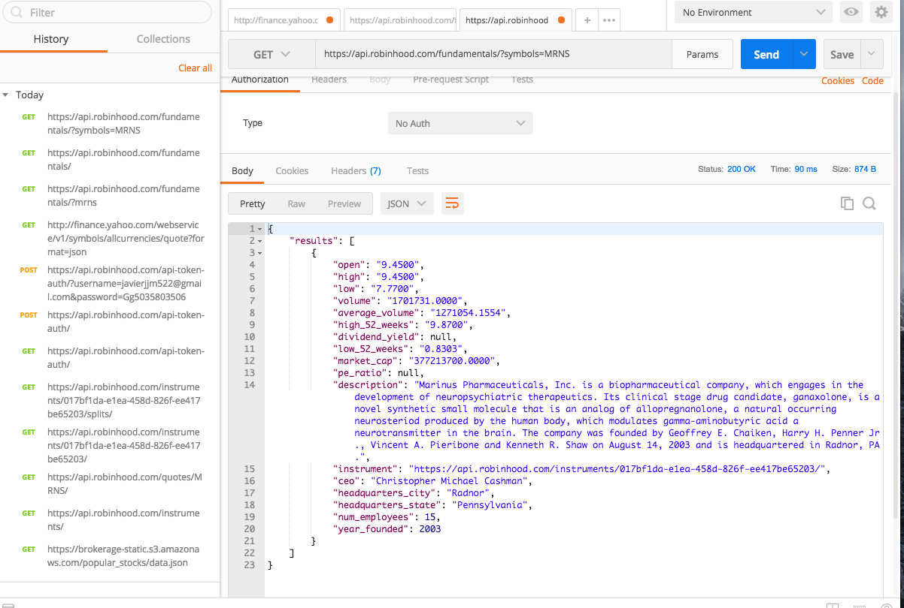

# README

This README would normally document whatever steps are necessary to get the
application up and running.

Things you may want to cover:

  

* _Found API for my website, url https://api.robinhood.com/fundamentals
                            params symbols = MRNS all caps_

* _I will be using this api and more https://github.com/sanko/Robinhood, https://blog.quandl.com/api-for-stock-data ._

